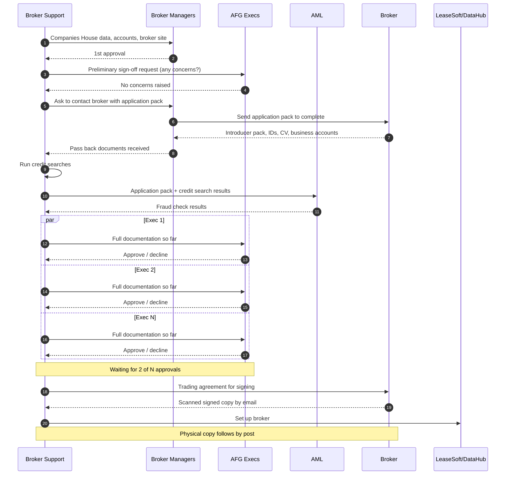

```mermaid
sequenceDiagram
    autonumber
    participant BS as Broker Support
    participant BM as Broker Managers
    participant AE as AFG Execs
    participant AML as AML
    participant B as Broker
    participant LS as LeaseSoft/DataHub

    BS->>BM: Companies House data, accounts, broker site
    BM-->>BS: 1st approval
    BS->>AE: Preliminary sign-off request (any concerns?)
    AE-->>BS: No concerns raised
    BS->>BM: Ask to contact broker with application pack
    BM->>B: Send application pack to complete
    B-->>BM: Introducer pack, IDs, CV, business accounts
    BM-->>BS: Pass back documents received
    BS->>BS: Run credit searches
    BS->>AML: Application pack + credit search results
    AML-->>BS: Fraud check results
    par Exec 1
        BS->>AE: Full documentation so far
        AE-->>BS: Approve / decline
    and Exec 2
        BS->>AE: Full documentation so far
        AE-->>BS: Approve / decline
    and Exec N
        BS->>AE: Full documentation so far
        AE-->>BS: Approve / decline
    end
    Note over BS,AE: Waiting for 2 of N approvals
    BS->>B: Trading agreement for signing
    B-->>BS: Scanned signed copy by email
    BS->>LS: Set up broker
    Note over B,BS: Physical copy follows by post
```